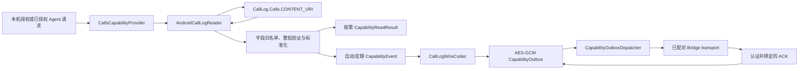

# Android 通话记录适配器设计规格

- 日期：2026-08-14
- 状态：四节设计与本文书面规格均已获用户确认
- 目标平台：Android 14（API 34）及以上
- 分发前提：受控设备私有分发或侧载；Google Play 上架不属于本切片验收范围
- 上位规格：`docs/superpowers/specs/2026-08-08-agent-bridge-android-design.md`

## 1. 摘要

本切片实现 `capability-ports` 中 `CALLS` 能力的首个 Android 平台适配器。它只读取并同步历史通话记录元数据，不实现当前通话状态监听、拨号、接听、挂断、录音、转写、voicemail 读取、联系人解析或通话记录写入。

实现采用独立的 `:call-log-collector` Android Library，复用现有 AES-GCM `CapabilityOutboxStore`，并从 SMS 私有实现中抽取一个只负责已持久事件投递的 `:capability-sync-runtime`。通话 Provider、号码授权、wire codec、游标和本机策略仍由通话模块独立拥有，避免在第二个适配器之前建立过度通用的采集框架。

本切片遵循以下已确认边界：

- 所有数据来源默认关闭；本机用户授权不能由 Agent 创建或扩大。
- 通话记录仅包含封闭字段白名单。
- 对方号码是独立的敏感元数据字段，可设为 withheld 或 released。
- 自动/定期同步的完整标准化 record wire 在游标推进前进入加密 outbox。
- 失效授权在真正外发前重新检查；旧 revision 不能继续发送。
- `READ_CALL_LOG` 的 manifest 声明、runtime grant 和 Provider 实际可访问是三个不同事实。
- 普通侧载环境只能证明正确拒绝；没有 installer allowlist 与受控设备证据时，不宣称通话记录正向读取已就绪。

## 2. 范围

### 2.1 目标

1. 为 `CallsCapabilityProvider` 提供真实的 Android `CallLog.Calls` 只读实现。
2. 只发布来电、去电、未接和拒接四类通话记录。
3. 支持按需读取和已获本机授权的自动/定期批次采集。
4. 对通话方向、历史范围和号码释放策略实行封闭、精确匹配的本机授权。
5. 使用 AES-256-GCM outbox 持久保存待投递 record wire，并在认证 ACK 前保留。
6. 使用认证加密状态保存 source epoch、策略 revision 和 Provider 游标。
7. 提取可由 SMS 与通话记录复用的 capability outbox dispatcher，同时保持 Provider 与 transport 解耦。
8. 通过 Kotlin 单元测试、TypeScript schema 测试、SDK-free 静态门禁和明确的设备证据矩阵证明边界。

### 2.2 非目标

- 不监听或发布当前 `idle`、`ringing`、`offhook` 状态。
- 不声明 `READ_PHONE_STATE` 或 `READ_PRECISE_PHONE_STATE`。
- 不拨号、接听、挂断、拦截、重定向或筛选电话。
- 不录音、转写或返回录音/voicemail URI。
- 不读取 voicemail、call-composer 图片、位置、subject 或厂商私有列。
- 不读取联系人缓存名称、照片或 lookup URI；联系人由独立适配器实现。
- 不把 `PHONE_ACCOUNT_ID` 猜测为 SIM/subscription ID。
- 不修改、插入或删除系统通话记录。
- 不跨 Android user 或 work profile 读取。
- 不承诺周期任务跨重启自动恢复；首版不声明 `RECEIVE_BOOT_COMPLETED`。
- 不在本切片实现 Bridge 侧长期查询产品、Hermes/OpenClaw 工具或当前通话状态。
- 不以本切片重新定义 P0a 签名 `device_event` envelope；本地 record wire 继续受既有 transport 边界约束。

## 3. 方案选择

采用“逐能力垂直切片，第二个适配器后再抽取真实共性”的方案。

本切片只抽取 SMS 已经证明存在的投递共性：恢复未 ACK 事件、检查 egress policy、打开已验证 Bridge session、发送、验证 ACK 和删除已确认事件。Call Log 与 SMS 不共享 Android 查询、字段、游标、wire codec、设置 authority 或调度模型。

未采用以下方案：

- 先建统一 collector 框架：Call Log、Contacts、Calendar、SensorManager、AccessibilityService 和 MediaProjection 的数据生命周期差异过大，首期抽象会缺少实现证据。
- 把所有能力放入单个 `device-adapters` 模块：这会把只读 Provider、屏幕和命令权限耦合，降低静态证明能力。

## 4. 模块与组件边界

### 4.1 `:capability-ports`

负责平台无关的封闭合约：

- `CallDirection`
- `CallNumberPresentation`
- `CallCounterpartyAccess`
- `CallHistoryPolicy`
- `CapabilityFilter.Calls`
- 扩展后的 `CallsMetadata`
- `CallsPayload`
- 通话号码 normalizer
- `CallsCapabilityProvider`

该模块不导入 Android API，不访问 Provider，不持久化数据，也不发送网络请求。

### 4.2 `:call-log-collector`

包名使用 `com.openandroidintelligence.calls`，负责：

- `AndroidCallLogReader`：唯一的 `ContentResolver.query` 薄适配层。
- `CallLogRow` 与 `CallLogQuery`：经过构造约束的内部 Provider 行和查询请求。
- `AndroidCallLogCapabilityProvider`：把已授权 scope 转换成有限查询并标准化 payload。
- `CallLogWireCodec`：生成字段顺序固定的闭合 v1 JSON record wire。
- `CallLogCursor` 与 `CallLogSyncStateStore`：维护 Provider 增量位置、source epoch 和 revision。
- `CallLogAutoSyncCoordinator`：执行“验证批次、enqueue、推进游标、投递”的顺序。
- 本机通话来源 authority：持久化 enabled、方向、号码策略、历史范围、同步模式和 revision。
- `CallLogSyncInterval`：只允许 `MANUAL`、`MINUTES_15`、`MINUTES_30`、`MINUTES_60`。
- `CallLogSyncScheduler`、`AndroidCallLogSyncScheduler` 与 `CallLogSyncJobService`：提供本机 best-effort 周期触发；Agent 请求不能修改本机调度设置。

模块不建立 socket，不知道 Bridge endpoint，不解析 ACK 签名，也不暴露 Provider Cursor。

### 4.3 `:capability-sync-runtime`

负责通用的 outbox 投递，不调用 Android Provider：

```kotlin
fun interface CapabilityPairedBridgeBindingSource {
    fun currentBinding(): VerifiedPairingTransportBinding?
}

fun interface CapabilityEventEgressGate {
    fun allows(event: CapabilityDurableEvent): Boolean
}

class CapabilityOutboxDispatcher(
    private val expectedCapability: String,
    private val outbox: CapabilityOutbox,
    private val transport: PairedBridgeTransport,
    private val bindingSource: CapabilityPairedBridgeBindingSource,
    private val egressGate: CapabilityEventEgressGate,
    private val maxAttempts: Int,
)
```

dispatcher 只处理 `expectedCapability` 精确匹配的事件。SMS 使用 `sms`，本切片使用 `calls.metadata`。capability 不匹配的事件保留并报告结构错误，不能发送或删除。

### 4.4 `:encrypted-store`

继续拥有：

- `CapabilityOutboxStore`
- `EncryptedOutboxPersistence`
- `FileEncryptedOutboxPersistence`
- `AndroidKeystoreOutboxKeyProvider`
- ACK verifier seam

本切片扩展通用 outbox 的本机撤销清除能力，但不复制 AES-GCM 实现。通话 sync state 使用相同密码学约束和独立文件/密钥，不与 outbox 共用 alias。

### 4.5 `:app`

只负责组合：

- 创建本机通话设置 authority。
- 创建通话 Provider、sync state、outbox、coordinator 和 dispatcher。
- 向设置 UI 暴露权限/Provider readiness 与本机开关。
- 从现有配对 registry 提供已验证 binding 和 ACK verifier。
- 以 fail-closed 方式处理密钥、状态或 ciphertext 损坏。

`assistant-holder` 不依赖 `:call-log-collector`，也不声明 `READ_CALL_LOG`。

## 5. 数据流



### 5.1 按需读取

1. 本机 `CapabilityGrant` 已存在，并与请求 capability、过滤器、mode 和 revision 精确匹配。
2. availability 必须为 `READY`。
3. provider 接收内部铸造的 `AuthorizedReadScope`，而不是原始 Agent 请求。
4. reader 查询有限历史并一次性完成整批解析。
5. provider 标准化字段并在返回前重新检查授权 revision。
6. 返回 `CapabilityReadResult<CallsPayload>`。

按需读取不写 outbox、不建立订阅、不启动 JobService，也不改变本机授权。

### 5.2 自动/定期批次

1. 本机 authority 独立确认 auto-send 已启用；remote `agentMayRequest` 不等于本机周期授权。
2. provider 使用当前持久游标查询有限批次。
3. 所有行先完成验证和 payload 映射，再开始发出 Flow 事件。
4. 每条记录先生成完整 wire 并写入 outbox。
5. outbox 持久接受后才推进 Provider 游标。
6. dispatcher 恢复并发送当前 capability 的 pending 事件。
7. 只有经过配对/连接/capability/event 绑定验证的 ACK 才删除 outbox 条目。

### 5.3 本机周期调度

- `MANUAL` 取消通话记录 JobScheduler job。
- 15/30/60 分钟映射到固定的 periodic interval；不接受 Agent 提供的毫秒值、cron 或任意调度表达式。
- JobService 必须 `android:exported="false"`，并由 `android.permission.BIND_JOB_SERVICE` 保护。
- 每次 job 运行时重新读取本机 authority，重新完成 availability 与本机 auto-send 授权，不能复用进程内旧 token。
- 本切片不声明 `RECEIVE_BOOT_COMPLETED`，因此周期任务不宣称 reboot-resilient；readiness 和 UI 必须显示 best-effort 边界。
- 本机 scheduler 与 remote `agentMayRequest` 分离；Agent 只能请求已存在授权下的即时同步，不能改变 interval、历史、方向、号码策略或 mode。

## 6. 权限与 availability

### 6.1 Manifest

主 App 合并 manifest 增加且仅增加以下电话相关权限：

```xml
<uses-permission android:name="android.permission.READ_CALL_LOG" />
```

已有 telephony feature 保持可选：

```xml
<uses-feature
    android:name="android.hardware.telephony"
    android:required="false" />
```

禁止声明：

```text
WRITE_CALL_LOG
CALL_PHONE
ANSWER_PHONE_CALLS
READ_PHONE_STATE
READ_PRECISE_PHONE_STATE
READ_VOICEMAIL
WRITE_VOICEMAIL
RECORD_AUDIO
PROCESS_OUTGOING_CALLS
```

### 6.2 Hard-restricted 边界

Android 将 `READ_CALL_LOG` 定义为 dangerous 且 hard-restricted。installer-of-record 未 allowlist 时，普通 runtime permission 流程不能使应用真正持有该权限。manifest 声明、runtime grant 和 Provider 实际可访问必须分开显示与测试。

Google Play 的默认 handler/政策要求不属于首版私有分发验收；如果发布渠道改变，必须建立独立产品规格，不能复用本切片的私有分发结论。

### 6.3 Availability 顺序

1. 本机来源未启用：`DISABLED`。
2. Provider 不存在或不可解析：`PLATFORM_UNSUPPORTED`。
3. `checkSelfPermission(READ_CALL_LOG)` 未通过：`PERMISSION_REQUIRED`。
4. 权限显示已授予但最小查询抛出 `SecurityException`：`PERMISSION_REQUIRED`。
5. 已启用、权限通过且 Provider 可执行受限查询：`READY`。

Provider 探测只在用户本机启用来源后进行，避免未授权的隐式敏感数据探测。失败不能降级到 shell、Accessibility、Root、Assistant role 或其他 Provider。

## 7. Provider 查询边界

### 7.1 唯一 URI

唯一查询 URI：

```kotlin
CallLog.Calls.CONTENT_URI
```

禁止使用：

```kotlin
CallLog.Calls.CONTENT_URI_WITH_VOICEMAIL
CallLog.Calls.CONTENT_FILTER_URI
CallLog.CONTENT_URI
```

### 7.2 Projection

首版 projection 固定为六列：

```kotlin
arrayOf(
    CallLog.Calls._ID,
    CallLog.Calls.TYPE,
    CallLog.Calls.DATE,
    CallLog.Calls.DURATION,
    CallLog.Calls.NUMBER,
    CallLog.Calls.NUMBER_PRESENTATION,
)
```

明确禁止读取或透传：

- voicemail URI、transcription；
- cached name、lookup URI、normalized number、联系人类型或照片；
- location、geocoded location、call-composer subject/photo；
- post-dial digits、via number；
- phone account component/name/ID；
- data usage、screening app/component；
- 厂商私有列。

### 7.3 SQL 形状

结果数量通过官方 `LIMIT_PARAM_KEY` URI 参数限制：

```kotlin
val uri = CallLog.Calls.CONTENT_URI
    .buildUpon()
    .appendQueryParameter(
        CallLog.Calls.LIMIT_PARAM_KEY,
        history.maxRecords.toString(),
    )
    .build()
```

查询使用固定 sort order：

```text
date DESC, _id DESC
```

历史起点、允许类型和增量游标值全部使用 `selectionArgs`。Agent 不能提供 URI、projection、selection、列名或 sort order。

增量边界为：

```sql
date > ? OR (date = ? AND _id > ?)
```

SQL 层只选择本机已授权的四种方向。Provider 在明确 selection 下仍返回未知类型时，整批失败且游标不前进。

## 8. 封闭数据合约

### 8.1 通话方向

```kotlin
enum class CallDirection {
    INCOMING,
    OUTGOING,
    MISSED,
    REJECTED,
}
```

映射：

| Android Provider 值 | 标准值 | 行为 |
|---|---|---|
| `INCOMING_TYPE` | `INCOMING` | 接受 |
| `OUTGOING_TYPE` | `OUTGOING` | 接受 |
| `MISSED_TYPE` | `MISSED` | 接受 |
| `REJECTED_TYPE` | `REJECTED` | 接受 |
| `VOICEMAIL_TYPE` | 无 | SQL 层排除 |
| `BLOCKED_TYPE` | 无 | SQL 层排除，不冒充 rejected |
| `ANSWERED_EXTERNALLY_TYPE` | 无 | SQL 层排除，不冒充 incoming |
| 未知/OEM 值 | 无 | 整批 fail closed |

本机策略排除的类型不属于已授权数据集，因此不生成 loss marker。首版只有在已授权数据发生可证明的永久监听/队列缺口时才允许生成 loss marker；本切片不主动制造该类标记。

### 8.2 Number presentation

```kotlin
enum class CallNumberPresentation {
    ALLOWED,
    RESTRICTED,
    UNKNOWN,
    PAYPHONE,
    UNAVAILABLE,
}
```

未知 Provider presentation 值使整批失败，不透传整数，也不默认成 `UNKNOWN`。

### 8.3 Metadata

```kotlin
data class CallsMetadata(
    override val recordId: String,
    override val observedAtEpochMs: Long,
    val direction: CallDirection,
    val startedAtEpochMs: Long,
    val endedAtEpochMs: Long,
    val durationSeconds: Long,
    val numberPresentation: CallNumberPresentation,
) : CapabilityMetadata
```

约束：

- `recordId` 必须为 `call:<positiveDecimalLong>`。
- Provider ID 必须能安全解析为正的有符号 `Long`；拒绝前导零和越界值。
- `startedAtEpochMs >= 0`。
- `durationSeconds >= 0`。
- `endedAtEpochMs` 使用 `Math.multiplyExact(durationSeconds, 1_000L)` 与 `Math.addExact` 计算。
- `observedAtEpochMs >= 0`，且只表示采集时间。
- 不发布 `IS_READ`、`NEW` 或任何可诱导未来代码修改 Provider 状态的字段。

### 8.4 号码字段策略

```kotlin
enum class CallCounterpartyAccess {
    WITHHELD,
    NUMBER,
}

data class Calls(
    val directions: Set<CallDirection>,
    val counterpartyAccess: CallCounterpartyAccess,
) : CapabilityFilter
```

规则：

- `directions` 非空。
- request 与 local grant 必须精确匹配方向集合和号码策略。
- `WITHHELD` 永远不释放 Provider 号码。
- `NUMBER` 只有在 presentation 为 `ALLOWED` 且 Provider 号码非空、非空白时释放。
- restricted、unknown、payphone 和 unavailable 均 withheld。
- 不执行猜测性 E.164 归一化，不查询联系人名称或 cached normalized number。
- 号码不进入 record ID、event ID、日志、异常、指标标签或 loss marker。

```kotlin
data class CallsPayload(
    val metadata: CallsMetadata,
    val counterpartyNumber: NormalizedContent<String>,
) : CapabilityPayload
```

### 8.5 历史范围

```kotlin
const val MAX_CALL_LOG_BATCH_RECORDS: Int = 10_000

data class CallHistoryPolicy(
    val fromEpochMs: Long?,
    val maxRecords: Int,
)
```

约束：

- `fromEpochMs == null || fromEpochMs >= 0`。
- `maxRecords` 必须在 `1..10_000`。
- 历史起点和最大记录数由本机策略拥有。
- Agent 只能请求本机 grant 已允许的相同范围，不能扩大历史或字段。
- 按需返回顺序为 `(date DESC, id DESC)`。
- auto-send 发出顺序为 `(date ASC, id ASC)`。

## 9. Record wire

新增闭合 schema：

```text
mvp-contract/schemas/v1/call-record.schema.json
urn:open-android-intelligence:mvp:call-record:v1
```

首版 record wire 示例：

```json
{
  "kind": "upsert",
  "record_id": "call:42",
  "source_epoch": "3",
  "record_revision": "1",
  "cursor_started_at_epoch_ms": "1786654800000",
  "cursor_provider_id": "42",
  "captured_at_epoch_ms": "1786658400000",
  "capture_revision": "7",
  "policy_revision": "7",
  "metadata": {
    "direction": "incoming",
    "started_at_epoch_ms": "1786654800000",
    "ended_at_epoch_ms": "1786654920000",
    "duration_seconds": "120",
    "observed_at_epoch_ms": "1786658400000",
    "number_presentation": "allowed"
  },
  "counterparty_number": {
    "state": "withheld"
  }
}
```

号码获准释放时：

```json
{
  "counterparty_number": {
    "state": "released",
    "value": "+8613800000000"
  }
}
```

约束：

- 根和所有子对象同时使用 `additionalProperties: false` 与 `unevaluatedProperties: false`。
- 所有 `Long`/`ULong` 使用 canonical 十进制字符串，拒绝负数、前导零、指数和浮点形式。
- `record_revision` 首版固定为 `1`；不猜测 Provider 修改版本。
- 号码最多 256 UTF-8 字节。
- withheld 分支不得带 `value`；released 分支必须带非空 `value`。
- JSON string 按 RFC 8259 转义。
- strict decoder 拒绝 duplicate keys、缺字段、额外字段、未知枚举、错误类型和 trailing bytes。
- codec 使用固定字段顺序，不依赖 `Map` 遍历顺序。

本 schema 表示 Android capability outbox 中的闭合 record wire，与当前 SMS MVP record wire 处于同一实现层级。它不被宣传为通用 P0a `device_event` envelope；设备签名、配对身份、连接 generation 和协议 ACK 的最终封装仍由 transport/control-wire 子系统拥有。若要收敛到 canonical Task 9 event/ACK，SMS 与 Call Log 必须在单独迁移规格中一起完成，不能让一个 capability 私自改变全局 envelope。

## 10. Outbox、source epoch 与游标

### 10.1 独立加密文件和密钥

通话记录不与 SMS 或通知共用物理文件或 Keystore alias：

```text
noBackupFilesDir/call-log-outbox-v1.aesgcm
Keystore alias: open_android_intelligence_call_log_outbox_v1

noBackupFilesDir/call-log-sync-state-v1.aesgcm
Keystore alias: open_android_intelligence_call_log_state_v1
```

AES-GCM envelope 使用：

```text
12-byte random IV
+ authenticated ciphertext
+ 128-bit authentication tag
```

Provider 行、号码、JSON wire 和 sync state 不以明文文件、SharedPreferences 或临时调试文件持久化。文件位于 `noBackupFilesDir`。

### 10.2 身份

```text
recordId = call:<providerId>
eventId  = call:<sourceEpoch>:<providerId>
```

`recordId` 表示当前安装中的 Provider 对象；`eventId` 加入 source epoch，防止撤销后重新授权的同一 Provider ID 与旧 ACK/outbox identity 冲突。

ACK verifier 必须绑定当前设备、配对 generation、连接 generation、capability、source epoch 和 event ID。旧 epoch ACK 不能删除新 epoch 条目。

### 10.3 Sync state

```kotlin
data class CallLogCursor(
    val startedAtEpochMs: Long,
    val providerId: Long,
) : Comparable<CallLogCursor>

data class CallLogSyncState(
    val sourceEpoch: ULong,
    val cursor: CallLogCursor?,
    val policyRevision: ULong,
)
```

规则：

- source epoch 从 `1` 开始且不能为零。
- cursor 按 `(startedAtEpochMs, providerId)` 比较，只能严格前进。
- source epoch 增加时 cursor 重置。
- source epoch 达到 `ULong.MAX_VALUE` 时永久停止当前 pairing generation 下的该来源；只有新配对 generation 或新的 App 安装身份可以重新建立，不能在原 pairing 内回绕或重置为 `1`。
- ciphertext 认证失败、未知版本、截断或 trailing bytes 时 fail closed。
- 损坏不能回退到“无 cursor 并重传全部历史”。

### 10.4 持久化顺序

每条自动同步记录严格执行：

```text
标准化 Provider 行
→ 生成完整 record wire
→ CapabilityOutbox.enqueueAccepted
→ outbox 持久接受
→ CallLogSyncStateStore.advance
→ 允许 dispatcher 外发
```

绝不先推进 cursor 再写 outbox。

### 10.5 Recovery reconciliation

每次运行开始时：

1. 恢复所有未 ACK 的通话 outbox 事件。
2. strict-decode 每个事件，验证 capability、source epoch、record ID、policy revision 与 wire cursor。
3. 找到当前 epoch 中最高 durable cursor。
4. durable cursor 高于 sync-state cursor 时，先补进 state。
5. reconciliation 成功后才开始采集或发送。
6. 任何 pending wire 无法严格解析时，整个通话同步 fail closed，保留 ciphertext，不发送其余事件。

Crash cut：

| 崩溃位置 | 恢复语义 |
|---|---|
| Provider 查询后、enqueue 前 | cursor 未推进，重新读取 |
| enqueue 后、cursor 推进前 | 从 pending wire 恢复 cursor 并修复 state |
| cursor 推进后、发送前 | outbox 保留并稍后发送 |
| 发送后、ACK 前 | 至少一次重投，Bridge 按事件身份去重 |
| ACK 后、outbox 删除前 | 认证 ACK 重放后完成删除 |
| outbox 删除后 | 已持久 cursor 阻止重新采集 |

### 10.6 容量与背压

沿用通用 store 上限：

- 单 event wire 最大 4 MiB。
- 单 capability outbox 最多 10,000 个事件。

通话记录 outbox 满时：

- 拒绝新事件；
- 不驱逐旧事件；
- 不推进失败事件的 cursor；
- 停止读取本批次后续页；
- 返回 `OUTBOX_FULL`；
- 网络恢复并释放空间后从同一 cursor 继续。

不以静默丢弃换取可用性。

## 11. 撤销与策略变化

关闭来源、收窄号码字段、改变方向集合或改变历史/同步授权会创建新的 source epoch，并使旧事件不可外发。

为了跨崩溃保持顺序，本机 authority 使用持久撤销阶段：

```text
ENABLED
→ REVOKING(targetEpoch, targetPolicyRevision)
→ DISABLED 或 ENABLED(new policy)
```

步骤：

1. 原子持久化 `REVOKING`，egress gate 立即拒绝旧 revision。
2. 停止采集与 dispatcher。
3. 清除通话 outbox，并删除旧 outbox Keystore key，形成 cryptographic erasure。
4. 写入 target epoch、空 cursor 与新 revision 的 sync state；需要时轮换 state key。
5. 原子提交最终 `DISABLED` 或新策略的 `ENABLED`。
6. App 启动发现 `REVOKING` 时从已持久 target state 继续，不能回到旧策略。

任一步失败时来源保持不可用，旧 revision 不能发送，失败 evidence 不被覆盖。UI 显示本机清除/重置失败并允许用户重试。普通断网、Bridge 离线、Doze 或 ACK 丢失不触发撤销清除；这些情况继续保留 ciphertext。

删除文件本身不被当作闪存安全擦除保证；旧 Keystore key 删除才提供 cryptographic erasure。若密钥已删除但 ciphertext 文件删除失败，来源仍保持关闭并报告清理未完成，但旧内容已无法解密。

## 12. Dispatcher 安全规则

通用 dispatcher 必须：

- 只处理配置的 capability。
- 在打开连接前检查最新策略。
- `open()` 返回后再次检查。
- `sendControl()` 前执行最终 egress fence。
- 不解析、打印或修改敏感 record 内容；只有 reconciliation 的独立 strict decoder 可以读取本 capability wire。
- 无 pairing、transport 失败或 ACK 丢失时保留事件。
- 只有认证并绑定正确的 ACK 才调用 `outbox.acknowledge()`。
- capability 不匹配的事件保留并报告结构错误。
- cancellation 时关闭 session 并保留未 ACK 数据。
- 不因某条发送失败而越过它确认后续 cursor。

SMS 迁移到通用 dispatcher 后必须保持原有测试与行为。Call Log dispatcher 不能发送 SMS，SMS dispatcher 不能发送 Call Log。

## 13. 失败模型

### 13.1 按需读取

| 错误代码 | 条件 | 结果 |
|---|---|---|
| `CALL_LOG_DISABLED` | 本机未启用 | `FAILED`，空记录 |
| `CALL_LOG_PERMISSION_REQUIRED` | permission 未授予或查询抛 `SecurityException` | `FAILED`，空记录 |
| `CALL_LOG_PLATFORM_UNSUPPORTED` | Provider 不存在 | `FAILED`，空记录 |
| `CALL_LOG_QUERY_FAILED` | Provider/Cursor 异常或缺列 | `FAILED`，空记录 |
| `CALL_LOG_INVALID_ROW` | ID、时间、时长、类型或 presentation 非法 | `FAILED`，空记录 |
| `CALL_LOG_POLICY_STALE` | 读取前后 revision 不一致 | `FAILED`，丢弃结果 |
| `CALL_LOG_CANCELLED` | coroutine 取消 | 保留取消语义 |

按需读取不返回部分结果。Android 异常 message、selection args、号码和 Provider 值不能出现在 failure reason。

### 13.2 自动同步

```kotlin
enum class CallLogSyncFailure {
    SOURCE_DISABLED,
    PERMISSION_REQUIRED,
    PLATFORM_UNSUPPORTED,
    CAPTURE_FAILURE,
    INVALID_PROVIDER_ROW,
    OUTBOX_FULL,
    OUTBOX_CORRUPTED,
    SYNC_STATE_CORRUPTED,
    CURSOR_NOT_DURABLE,
    POLICY_REVOKED,
    PAIRING_UNAVAILABLE,
    UNSUPPORTED_CAPABILITY,
    TRANSPORT_FAILURE,
    ACK_REJECTED,
    CANCELLED,
}
```

`CancellationException` 单独处理；不使用会吞掉 fatal JVM error 的宽泛异常策略。Cursor 始终通过 `use` 关闭。

## 14. 日志、指标与审计

生产日志禁止包含：

- 电话号码；
- 通话开始/结束时间；
- Provider ID 或 cursor；
- projection/selection arguments；
- record wire 或 ACK wire；
- Android 异常 message；
- outbox/state 明文。

允许的审计字段：

```text
capability = calls.metadata
不透明 operation/request ID
policy revision
稳定结果代码
读取/接受/ACK 数量
耗时分桶
权限、存储或 transport 失败类别
```

source epoch 只在安全审计确需关联时保存不可逆摘要。指标标签不使用设备号、号码、record ID 或时间范围。

Call Log row、payload、sync state 和结果对象不能使用会泄露字段的默认 `data class toString()` 进入日志；生产对象提供经过审阅的脱敏 `toString()`，或日志调用只接收单独的 allowlist 审计结构。

## 15. 测试策略

实现严格遵循 RED → GREEN → REFACTOR。每个生产行为先有因功能缺失而失败的测试。

### 15.1 `capability-ports`

- 历史策略拒绝负时间、零条和超过 10,000 条。
- Calls filter 拒绝空方向集合。
- request/grant 的方向或号码策略不完全一致时拒绝。
- direction set 的序列化按 enum 注册顺序固定，不能依赖 `Set` 遍历顺序。
- record ID 拒绝零、负数、前导零、缺前缀和超过 `Long.MAX_VALUE`。
- 四种 direction、五种 presentation 和两种 counterparty access 均为闭合集合。
- ended time 精确计算并拒绝乘法/加法溢出。
- withheld 永远不释放号码。
- number 只在 presentation allowed 且号码非空时释放。
- capability、mode 或 revision 错配不能产生通话 scope。

### 15.2 Android reader

- 唯一 URI 与六列 projection。
- `LIMIT_PARAM_KEY` URI 参数，不在 SQL 文本拼接 LIMIT。
- 历史、方向和 cursor 动态值只进入 selection args。
- 固定 sort order 与同毫秒 ID 次序。
- null Cursor 返回空列表。
- 成功、缺列、坏行和异常路径都关闭 Cursor。
- type/presentation 精确映射。
- voicemail/blocked/answered-externally 不误映射。
- 负 ID/时间/时长和溢出使整批失败。
- Provider 超量返回时仍执行本地上限。

### 15.3 Provider 与授权

- 按需降序、auto-send 升序。
- 方向与号码策略同时在查询和 payload 层执行。
- `SecurityException` 映射 permission required。
- 其他查询失败不泄露异常 message。
- 读取期间 revision 改变时丢弃结果。
- on-demand 不写 outbox 或启动调度。
- 本机周期授权与 remote `agentMayRequest` 分离。
- event capability、event ID、record ID 和 revision 精确一致。

### 15.4 Scheduler 与 JobService

- 四个 interval 与毫秒值一一对应。
- manual 会取消 job。
- 非 manual 会以稳定 job ID 替换旧配置。
- JobService 运行时重新读取 authority、availability、policy revision 和 authorization revision。
- disabled、permission missing、corrupt settings 或 stale revision 不调用 coordinator。
- `onStopJob` 取消当前运行且不删除 outbox；是否重试由最新本机设置决定。
- service 不导出，并且没有 boot receiver 或 `RECEIVE_BOOT_COMPLETED`。

### 15.5 Wire 与 TypeScript schema

- withheld/released 精确 golden bytes。
- 固定字段顺序、UTF-8 与 RFC 8259 escaping。
- 最大合法 ID 与下一越界值。
- canonical 十进制字符串。
- 未知枚举、额外/缺少字段、null、错误类型和 duplicate keys 拒绝。
- Kotlin fixture 通过 TypeScript validator；canonical TypeScript fixture 通过 Kotlin decoder。

### 15.6 Outbox 与 sync state

- persistence 看不到号码、JSON 字段或时间明文。
- 相同密钥重启恢复。
- 错误 key、篡改 tag、截断、未知版本和 trailing bytes fail closed。
- 输入/返回 wire defensive copy。
- byte-identical enqueue 幂等；同 ID 不同内容冲突。
- 无效 ACK 保留，认证 ACK 删除。
- 满容量不驱逐。
- Call Log/SMS/notification 使用不同文件和 alias。
- cursor 只严格前进；epoch 变化重置。
- state 损坏不从头同步。
- enqueue 后 state 前崩溃可 reconciliation。
- pending wire identity/revision/cursor 不一致时拒绝外发。

### 15.7 Coordinator 与 dispatcher

- trace 证明 enqueue → cursor → egress。
- enqueue 失败不推进 cursor。
- cursor 持久化失败时新事件保留但不外发。
- transport/ACK 失败保留。
- pairing 缺失不发送。
- enqueue 后、open 中和 send 前撤销均阻断。
- cancellation 关闭 session 并保留。
- capability 严格隔离。
- dispatcher 抽取后全部 SMS 回归测试继续通过。
- 失败事件不能被越过后确认后续 cursor。

## 16. SDK-free 静态门禁

新增 `apps/android/tools/test_call_log_collector_static.py`，验证：

- Gradle 模块和 App 依赖已注册。
- manifest 包含 `READ_CALL_LOG`，telephony 保持 optional。
- 所有禁止电话权限均不存在。
- `assistant-holder` 不声明或依赖 Call Log。
- Call Log JobService 不导出、受 `BIND_JOB_SERVICE` 保护，且不存在 boot receiver/`RECEIVE_BOOT_COMPLETED`。
- 唯一 Provider URI 和 projection 白名单。
- 不调用 `insert`、`update`、`delete`、`bulkInsert`。
- collector 源码不出现 `TelecomManager`、`TelephonyManager`、phone listener/callback、InCall/Screening service、BroadcastReceiver、ContentObserver、Accessibility、MediaProjection、process execution、shell、socket、URL 或 HTTP client。
- collector 不依赖 transport；只有 sync runtime 使用窄 `PairedBridgeTransport`。
- SMS manifest 静态测试显式加入 `READ_CALL_LOG` 后仍继续禁止写入和电话控制权限。
- readiness 文档写明 hard-restricted 权限和设备证据边界。

## 17. Android 设备证据矩阵

### 17.1 普通侧载负向路径

- App 可安装。
- 来源显示 `PERMISSION_REQUIRED`。
- Provider 不产生数据。
- 不尝试 shell、角色或其他接口绕过。
- 其他非电话能力不受影响。

### 17.2 受控安装正向路径

- installer-of-record allowlist `READ_CALL_LOG`。
- runtime permission 已授予。
- 测试通话记录按白名单读取。
- withheld 模式不返回号码。
- number 模式只返回 presentation-allowed 号码。
- runtime 撤销后下一读取立即失败。
- 同步期间撤销由最终 egress fence 阻断。
- App 重启恢复加密 outbox。
- `assistant-holder` UID 不持有 Call Log 权限。

### 17.3 其他设备条件

- 无 Call Log Provider/无相关平台能力。
- secondary user/work profile 隔离。
- 同时间戳多条记录。
- 锁屏、Doze、断网和 ACK 丢失。
- 强制停止后的 best-effort 边界。

测试不向生产 APK 增加 `WRITE_CALL_LOG`。正向数据由受控测试设备预置或真实测试呼叫产生。

## 18. 验证命令

聚焦 Android 单元测试：

```bash
cd /home/djbd/项目/open-android-intelligence/apps/android

./gradlew --no-daemon --console=plain \
  :capability-ports:testDebugUnitTest \
  :capability-sync-runtime:testDebugUnitTest \
  :call-log-collector:testDebugUnitTest \
  :encrypted-store:testDebugUnitTest \
  :sms-collector:testDebugUnitTest \
  :app:testDebugUnitTest
```

SDK-free 门禁：

```bash
cd /home/djbd/项目/open-android-intelligence

python3 -m unittest \
  apps/android/tools/test_call_log_collector_static.py \
  apps/android/tools/test_sms_collector_static.py \
  apps/android/tools/test_transport_boundary.py
```

schema 与 validator：

```bash
cd /home/djbd/项目/open-android-intelligence

npx vitest --root . run mvp-contract/test/call-contract.test.ts
npx tsc --noEmit -p mvp-contract/tsconfig.json
```

完整回归：

```bash
cd /home/djbd/项目/open-android-intelligence

e2e/mvp/run-smoke.sh --sdk-free
e2e/mvp/run-readiness.sh --sdk-free

cd apps/android
./gradlew --no-daemon check
```

缺少 Android SDK、受控 installer 或测试设备时，对应项标为未验证。SDK-free/JVM 通过不能冒充 hard-restricted 权限正向设备证据。

## 19. 验收标准

1. `READ_CALL_LOG` 是唯一新增电话相关权限，telephony feature 保持 optional。
2. Provider projection 和发布 payload 均为闭合字段白名单。
3. 不存在电话控制、录音、voicemail、电话状态监听或 Call Log 写入表面。
4. 按需读取与 auto-send 分离，且都需要精确本机授权。
5. 对方号码可独立配置 withheld/released，并遵守 presentation。
6. 自动同步 wire 在 cursor 推进前进入 AES-GCM outbox。
7. outbox 与 sync state 可重启恢复，篡改时 fail closed。
8. 撤销阶段跨崩溃保持 fail closed，旧 revision 不外发。
9. 非法 Provider 行、存储损坏、满容量和 ACK 失败不产生静默丢失或 cursor 跳跃。
10. 通用 dispatcher 抽取不破坏 SMS 行为。
11. Kotlin、TypeScript、SDK-free 门禁和当前环境可运行的 Android 测试全部通过。
12. readiness 文档区分代码完成、SDK 测试完成和 hard-restricted 正向设备证据完成。
13. 周期调度只有四个封闭选项，且在没有 boot permission 时明确标记为 best-effort、非 reboot-resilient。

## 20. 官方参考资料

- [Manifest.permission.READ_CALL_LOG](https://developer.android.com/reference/android/Manifest.permission#READ_CALL_LOG)
- [CallLog.Calls](https://developer.android.com/reference/android/provider/CallLog.Calls)
- [Permissions used only in default handlers](https://developer.android.com/guide/topics/permissions/default-handlers)
- [`<uses-feature>`](https://developer.android.com/guide/topics/manifest/uses-feature-element)
